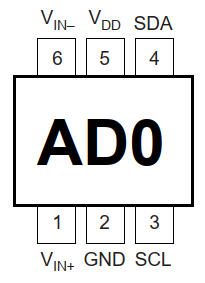

# ADS1100 Arduino Library

ADS1100 is a 16-Bit, 128SPS, 1-Ch Delta-Sigma Analogue to Digital converted made by Texas Instruments. The unit uses only external reference - the same as VDD. It is convenient to measure resistance rather than absolute voltages.

It is a minimalistic library that supports basic operations and continuous as well as single conversion modes.

See more details at [Texas Instruments](http://www.ti.com/product/ADS1100).

# Library Functions  
__begin()__  
Parameters:  None  
Description: Starts the I2C communication (Wire.begin) with the ADS1100 unit  
Returns:     None

__getvalue()__  
Parameters:     None  
Description:    Reads the ADC value data regardless of the fact it is recent or not. Works (obligatory) in continuous reading mode, optional in the single mode. Read the __value__ int16_t instead.  
Returns:        int16_t (can be negative if Vin- is not wired to GND. If wired to GND, a slight negative value is still possible

__configure(uint8_t singleMode, uint8_t dataRate, uint8_t gain)__  
Parameters:     None  
Description:    Configures the operation mode of the ADS1100 unit  
Details:        (ADS1100_CONVERSION_SINGLE or ADS1100_CONVERSION_CONTINOUS, ADS1100_DATA_RATE_128SPS or ADS1100_DATA_RATE_32SPS or ADS1100_DATA_RATE_16SPS or ADS1100_DATA_RATE_8SPS, ADS1100_GAIN_1X or ADS1100_GAIN_2X or ADS1100_GAIN_4X or ADS1100_GAIN_8X)  
Returns:        None  

__conversionDone()__  
Parameters:     None  
Description:    Checks (i) if the conversion is completed and ii) reads the ADC value. If the conversion is not completed yet, the ADC value is the old one  
Returns:   1 if the conversion is completed, 0 otherwise  

__startSingleConversion()__  
Parameters:     None  
Description:    Requests the unit to start the reading the ADC value. The reading actually takes the whole reading time  
Returns:        None  

# Examples  
__Continuous_read__  
The example shows continuous reading from the unit. The user is responsible for ensuring that the reading is properly updated. Reading the value before it is acquired will result in receiving old values.

__Single_read__  
The example reads ADC data from the unit and performs conversion only when requested. The user is responsible for ensuring that the reading is properly updated. Reading the value before it is acquired will result in receiving old values.

__Single_read_if_ready__  
The example reads ADC data from the unit and performs conversion only when requested.continuous reading from the unit. The output is performed only when conversion is performed actively checking for this condition. 

# Licence  
[GNU General Public License v3.0](https://github.com/cherkasovn/ADS1100/blob/master/LICENSE)
Distributed in the hope that it will be useful, but WITHOUT ANY WARRANTY; without even the implied warranty of 	MERCHANTABILITY or FITNESS FOR A PARTICULAR PURPOSE.
